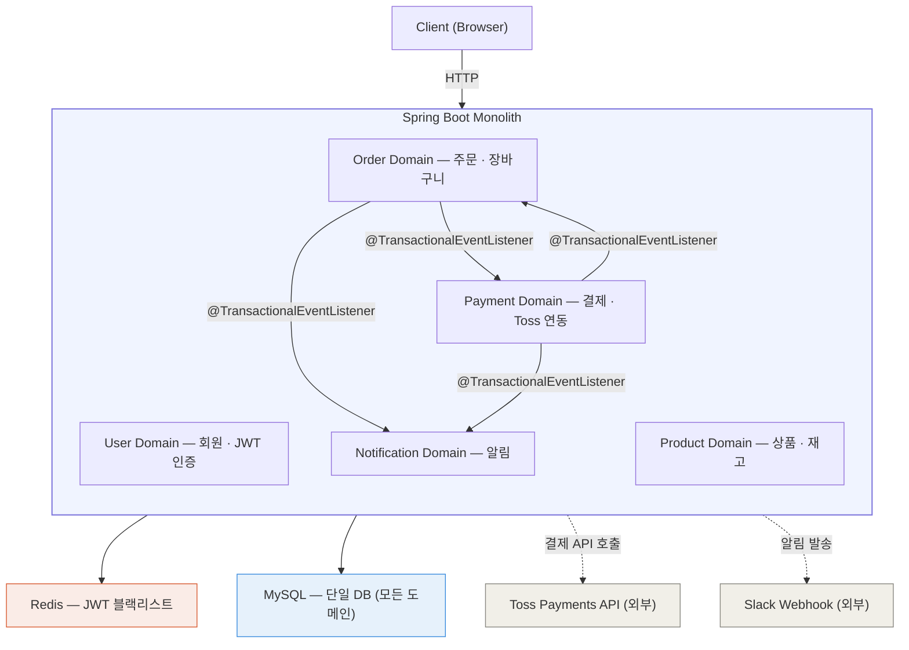
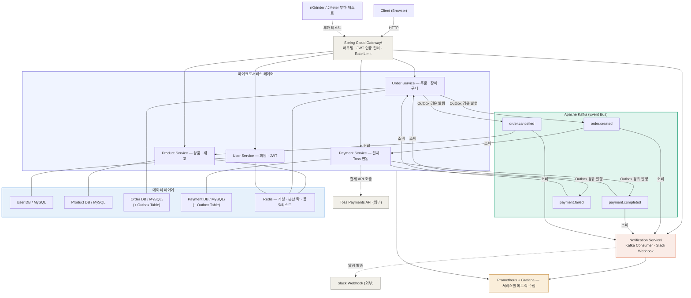
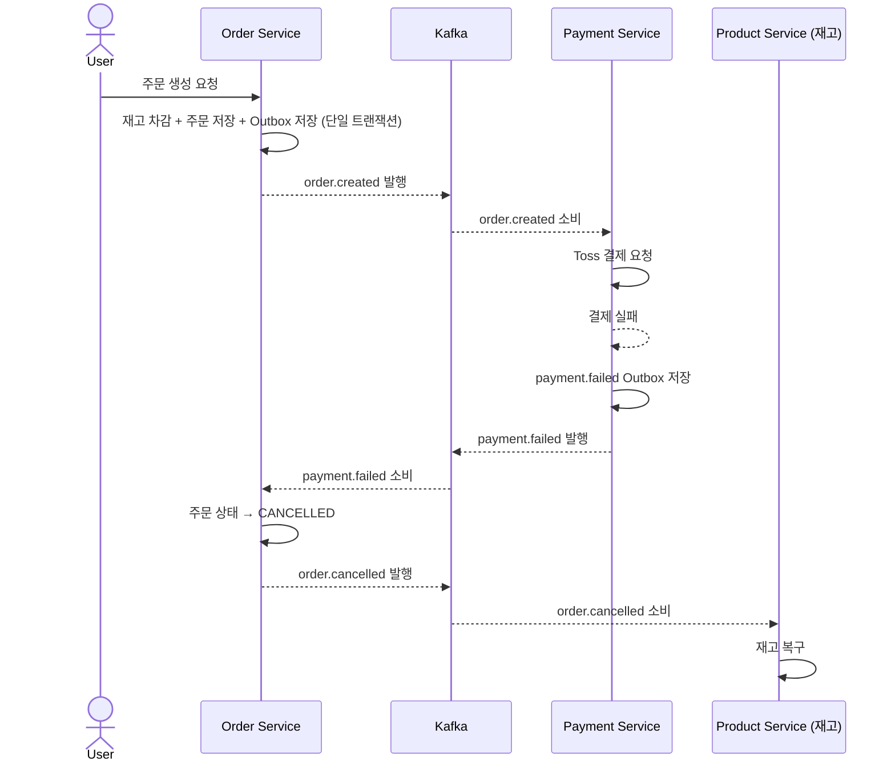
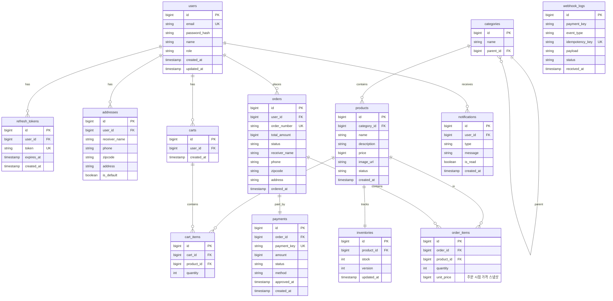
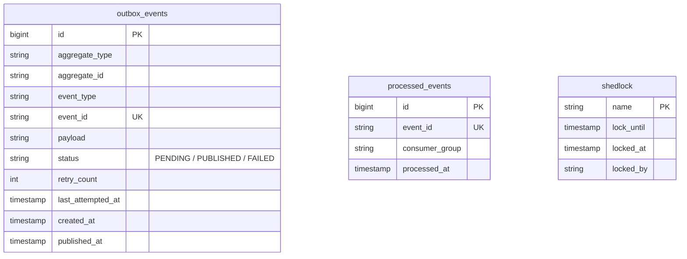
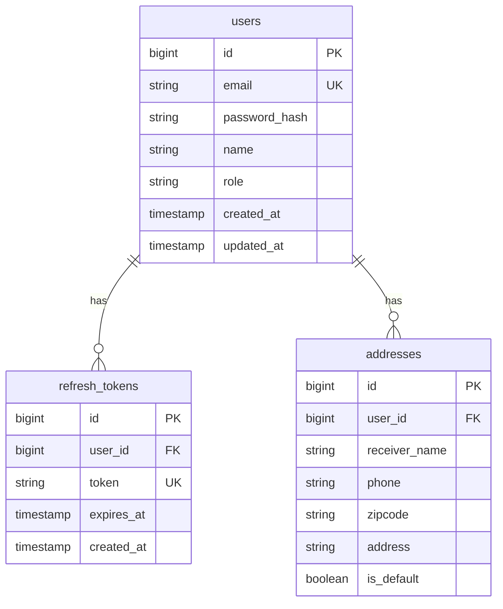
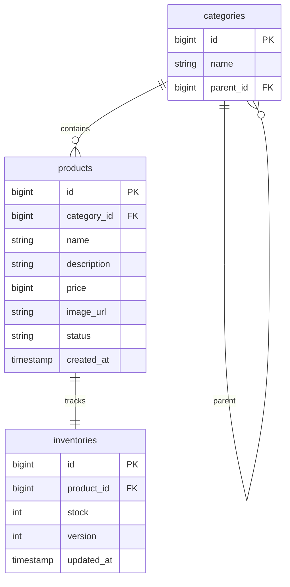
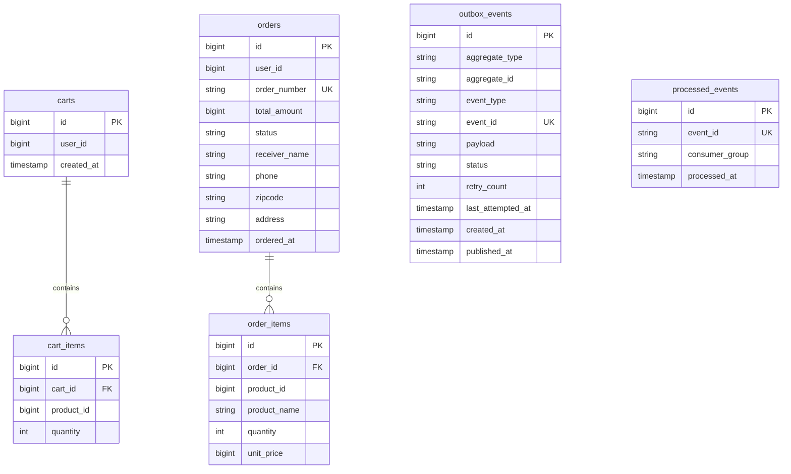
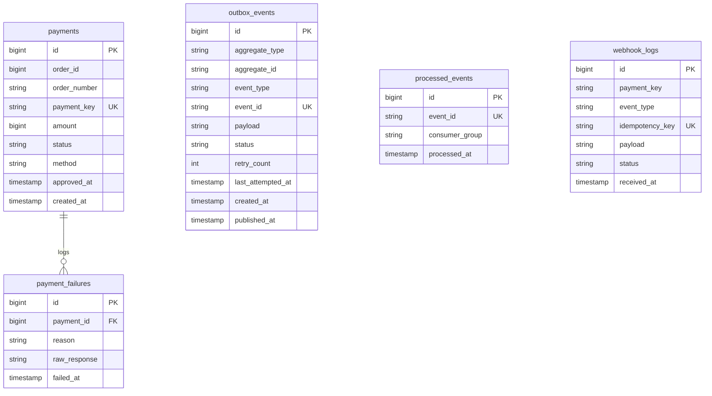
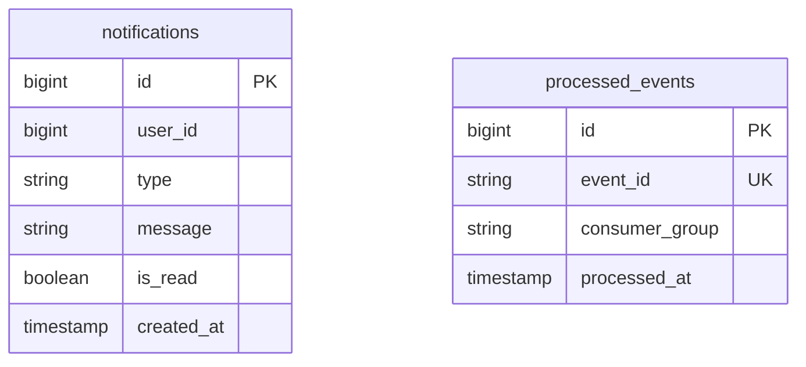

# PeekCart — 설계 통합 문서

> **고가용성 이커머스 플랫폼**
Java 17 · Spring Boot 3.x · Kafka · Redis · Toss Payments · Kubernetes
작성 기준: Phase 1 (모놀리식) → Phase 4 (MSA) 전체 설계
>

---

## 목차

1. [프로젝트 개요](https://www.notion.so/PeakCart-327e4057238480969ec3c958fa91c762?pvs=21)
2. [프로젝트 목표](https://www.notion.so/PeakCart-327e4057238480969ec3c958fa91c762?pvs=21)
3. [기술 스택](https://www.notion.so/PeakCart-327e4057238480969ec3c958fa91c762?pvs=21)
4. [아키텍처 방향](https://www.notion.so/PeakCart-327e4057238480969ec3c958fa91c762?pvs=21)
5. [시스템 아키텍처 다이어그램](https://www.notion.so/PeakCart-327e4057238480969ec3c958fa91c762?pvs=21)
6. [기능적 요구사항](https://www.notion.so/PeakCart-327e4057238480969ec3c958fa91c762?pvs=21)
7. [비기능적 요구사항](https://www.notion.so/PeakCart-327e4057238480969ec3c958fa91c762?pvs=21)
8. [Kafka 이벤트 설계](https://www.notion.so/PeakCart-327e4057238480969ec3c958fa91c762?pvs=21)
9. [주요 설계 결정](https://www.notion.so/PeakCart-327e4057238480969ec3c958fa91c762?pvs=21)
10. [알려진 한계 및 트레이드오프](https://www.notion.so/PeakCart-327e4057238480969ec3c958fa91c762?pvs=21)
11. [ERD 설계](https://www.notion.so/PeakCart-327e4057238480969ec3c958fa91c762?pvs=21)
12. [패키지 구조](https://www.notion.so/PeakCart-327e4057238480969ec3c958fa91c762?pvs=21)
13. [테스트 전략](https://www.notion.so/PeakCart-327e4057238480969ec3c958fa91c762?pvs=21)
14. [성능 테스트 시나리오](https://www.notion.so/PeakCart-327e4057238480969ec3c958fa91c762?pvs=21)
15. [포트폴리오 어필 포인트](https://www.notion.so/PeakCart-327e4057238480969ec3c958fa91c762?pvs=21)
16. [개발 로드맵](https://www.notion.so/PeakCart-327e4057238480969ec3c958fa91c762?pvs=21)

---

## 1. 프로젝트 개요

| 항목 | 내용 |
| --- | --- |
| 프로젝트명 | PeekCart |
| 유형 | 개인 포트폴리오 프로젝트 |
| 주제 | 대용량 트래픽 환경을 고려한 이커머스 플랫폼 설계 및 구현 |
| 개발 언어 | Java 17 |
| 프레임워크 | Spring Boot 3.x |
| 아키텍처 패턴 | 4-Layered Architecture + DDD |
| 레포 전략 | 모노레포 (Gradle 멀티모듈) |
| 서비스 구조 | 모놀리식으로 시작 후 핵심 서비스 MSA 분리 |
| 인프라 | Kubernetes (minikube 로컬) |

---

## 2. 프로젝트 목표

### 2-1. 기술적 목표

- 4-Layered Architecture + DDD 기반 도메인 모델 설계 및 구현
- Kafka 기반 이벤트 드리븐 아키텍처 + Transactional Outbox 패턴 적용
- Redis 캐싱 적용 전/후 성능 개선 수치 측정 및 검증
- Prometheus + Grafana 기반 실시간 모니터링 시스템 구축 (kube-prometheus-stack)
- nGrinder / JMeter를 활용한 부하 테스트 시나리오 작성 및 병목 개선
- Kubernetes HPA를 통한 자동 스케일아웃 검증
- Toss Payments 연동을 통한 실결제 플로우 구현 (가상 결제)
- 대규모 주문 데이터 처리 경험 (페이지네이션, 배치, 인덱싱 최적화)

### 2-2. 포트폴리오 목표

- 단순 CRUD를 넘어 트래픽 · 성능 · 안정성 · 인프라를 고려한 설계 능력 증명
- 기술 도입의 이유와 근거를 수치로 설명할 수 있는 프로젝트 완성
- "왜 이 기술을 썼는가?"에 대한 명확한 스토리라인 구성

---

## 3. 기술 스택

### 3-1. 기술 스택 목록

| 분류 | 기술 | 선택 이유 |
| --- | --- | --- |
| Language | Java 17 | LTS 버전, Record · Sealed class 활용 |
| Framework | Spring Boot 3.x | Spring 6 기반, Virtual Thread 지원 |
| 아키텍처 패턴 | 4-Layered + DDD | 도메인 로직 응집, 레이어 간 명확한 책임 분리 |
| Database | MySQL 8.x | 트랜잭션 정합성, 복잡한 조인 쿼리 |
| DB 마이그레이션 | Flyway | Phase 간 스키마 변경 이력 추적, 재현 가능한 마이그레이션 |
| Cache | Redis 7.x | 상품 캐싱, 분산 락, 블랙리스트 토큰 관리 |
| Message Queue | Apache Kafka | 주문 이벤트 비동기 처리, 서비스 간 디커플링 |
| API Gateway | Spring Cloud Gateway | 라우팅, JWT 인증 필터, Rate Limiting |
| 모니터링 | Prometheus + Grafana | kube-prometheus-stack, Pod 단위 메트릭 수집 |
| 결제 | Toss Payments API | 국내 표준 결제 플로우, 가상 결제 지원 |
| 알림 | Slack Webhook | Kafka Consumer 연동, 실제 발송 동작 증명 |
| 부하 테스트 | nGrinder + JMeter | nGrinder: 분산 테스트 / JMeter: 시나리오 테스트 |
| 빌드 | Gradle | 멀티모듈 구성, 빌드 캐시 활용 |
| 컨테이너 | Docker + Kubernetes (minikube) | 서비스별 독립 배포, HPA 자동 스케일아웃 |
| 레포 전략 | 모노레포 (Gradle 멀티모듈) | 전체 구조 가시성, common 모듈 공유 용이 |
| 문서화 | Swagger (springdoc) | API 명세 자동화 |

### 3-2. 핵심 기술 선택 대안 비교

| 선택 항목 | 채택 | 대안 | 채택 이유 | 미채택 사유 |
| --- | --- | --- | --- | --- |
| RDBMS | MySQL 8.x | PostgreSQL | 국내 이커머스 레퍼런스 다수, 운영 경험 풍부한 생태계 | PostgreSQL의 JSONB·Advanced Index는 본 프로젝트에서 활용하지 않음 |
| Message Queue | Apache Kafka | RabbitMQ | 이벤트 리플레이, 파티션 기반 순서 보장, 높은 처리량 | RabbitMQ는 라우팅 유연성이 장점이나 이벤트 소싱/리플레이 불가 |
| 캐시 | Redis 7.x | Caffeine (로컬 캐시) | 분산 환경 캐시 일관성, 분산 락·블랙리스트 등 다목적 활용 | Caffeine은 단일 인스턴스에서만 유효, MSA 전환 시 캐시 불일치 |
| Outbox 발행 | Polling 스케줄러 | Debezium CDC | 추가 인프라 없이 Spring Scheduler로 구현 가능, 포트폴리오 범위에서 적정 | CDC는 지연 최소화에 유리하나 Kafka Connect 클러스터 운영 복잡도 증가 |
| 분산 락 | Redis (Redisson) | MySQL Named Lock | 성능 우수, TTL 자동 해제, 분산 환경 확장 용이 | DB Named Lock은 커넥션 점유, MSA 분리 시 한계 |

---

## 4. 아키텍처 방향

### 4-1. 코드 아키텍처: 4-Layered + DDD

각 도메인은 아래 4개 레이어로 구성됩니다.

| 레이어 | 패키지 | 역할 |
| --- | --- | --- |
| Presentation | `presentation/` | Controller, Request/Response DTO |
| Application | `application/` | UseCase, Command/Query 조율, 트랜잭션 경계 |
| Domain | `domain/` | Entity, VO, Domain Service, Repository 인터페이스 |
| Infrastructure | `infrastructure/` | Repository 구현체, Kafka, Redis, Toss 연동 |

> **핵심 원칙**: 비즈니스 로직은 Service가 아닌 Entity / Domain Service 안에 위치합니다.
**JPA 절충안**: 도메인 엔티티에 JPA 어노테이션(`@Entity`, `@Id`, `@Column` 등)을 허용하되, 비즈니스 로직은 JPA API(`EntityManager`, `Session` 등)에 의존하지 않습니다. Entity-Domain Entity 분리 + 매핑 레이어의 보일러플레이트를 피하면서도 도메인 순수성을 유지하는 실용적 절충안이며, 실무에서도 일반적인 접근 방식입니다.
>

### 4-2. 서비스 전략: 모놀리식 → MSA 분리

| 단계 | 구조 | 내용 |
| --- | --- | --- |
| Phase 1 | 모놀리식 | 단일 Spring Boot, 4-Layered + DDD, `@TransactionalEventListener` |
| Phase 2 | 성능 개선 | Redis 캐싱, Kafka + Outbox 패턴 도입, 재고 동시성 제어 |
| Phase 3 | 인프라 / 테스트 | K8s 배포, Prometheus + Grafana, 부하 테스트, HPA 검증 |
| Phase 4 | MSA 분리 | Gradle 멀티모듈, Spring Cloud Gateway, 서비스별 DB 분리 |

### 4-3. 인프라 전략: Kubernetes (minikube)

- Phase 1~2: Docker Compose로 로컬 개발 환경 구성
- Phase 3~4: minikube K8s 클러스터로 전환
- kube-prometheus-stack Helm 차트로 Prometheus + Grafana 구축
- HPA로 Order Service Pod 자동 수평 확장 검증
- Liveness / Readiness Probe 설정으로 비정상 Pod 자동 재시작

### 4-4. 레포 전략: 모노레포 (Gradle 멀티모듈)

- 단일 GitHub 레포에서 전체 서비스 구조를 한눈에 파악 가능
- `common` 모듈로 이벤트 DTO, 공통 예외, 응답 포맷 공유
- 실무 기준에서는 서비스별 독립 배포와 권한 분리를 위해 멀티레포가 적합하나, 포트폴리오 가시성과 개발 효율을 위해 모노레포 채택

### 4-5. MSA 분리 대상 서비스

- **Order Service** — 주문 폭주 시 독립 스케일아웃 필요
- **Payment Service** — 결제 플로우 격리, 장애 전파 방지
- **Notification Service** — Kafka Consumer 전용, 비동기 알림 처리

---

## 5. 시스템 아키텍처 다이어그램

### Phase 1 — 모놀리식



> Phase 1에서는 Prometheus+Grafana를 사용하지 않습니다 (Phase 3에서 도입).
Redis는 JWT 블랙리스트 용도로만 사용합니다. 캐싱과 분산 락은 Phase 2에서 도입합니다.
>

### Phase 4 — MSA



---

## 6. 기능적 요구사항

### 6-1. 회원 (User)

- 회원가입 / 로그인 (JWT Access + Refresh Token)
- 회원 정보 조회 및 수정
- 관리자 / 일반 사용자 역할 분리 (RBAC)

### 6-2. 상품 (Product)

- 상품 등록 / 수정 / 삭제 (관리자 전용)
- 상품 목록 조회 (페이징, 카테고리 필터)
- 상품 상세 조회
- 재고 수량 관리

### 6-3. 주문 (Order)

- 장바구니 담기 / 수정 / 삭제
- 주문 생성 → `@TransactionalEventListener`로 결제/알림 도메인에 이벤트 전달 (Phase 1)
- 주문 생성 → Outbox 테이블 저장 → Kafka 이벤트 발행 (Phase 2 이후)
- 주문 내역 조회 (페이징)
- 주문 취소 (재고 롤백 포함)

### 6-4. 결제 (Payment)

- Toss Payments 결제 위젯 연동 (가상 결제)
- 결제 승인 / 실패 처리
- 결제 실패 시 주문 롤백 (Phase 1: `@TransactionalEventListener` / Phase 4: Choreography Saga)
- 결제 내역 조회
- 웹훅(Webhook) 수신 처리

### 6-5. 알림 (Notification)

- **Phase 1**: `@TransactionalEventListener`로 이벤트 수신 → Slack Webhook으로 알림 발송
- **Phase 2+**: Kafka Consumer로 이벤트 수신 → Slack Webhook으로 알림 발송
- 알림 내역 DB 저장 및 조회

### 6-6. 핵심 API 경로 목록

> URL 규칙: `/api/v1/{도메인}/...` — 상세 명세는 Swagger(springdoc)로 자동 생성합니다.
>

| 메서드 | 경로 | 설명 | 인증 |
| --- | --- | --- | --- |
| POST | `/api/v1/auth/signup` | 회원가입 | X |
| POST | `/api/v1/auth/login` | 로그인 | X |
| POST | `/api/v1/auth/refresh` | 토큰 재발급 | X |
| POST | `/api/v1/auth/logout` | 로그아웃 | O |
| GET | `/api/v1/users/me` | 내 정보 조회 | O |
| PUT | `/api/v1/users/me` | 내 정보 수정 | O |
| GET | `/api/v1/products` | 상품 목록 조회 | X |
| GET | `/api/v1/products/{id}` | 상품 상세 조회 | X |
| POST | `/api/v1/admin/products` | 상품 등록 (관리자) | O (ADMIN) |
| PUT | `/api/v1/admin/products/{id}` | 상품 수정 (관리자) | O (ADMIN) |
| DELETE | `/api/v1/admin/products/{id}` | 상품 삭제 (관리자) | O (ADMIN) |
| GET | `/api/v1/cart` | 장바구니 조회 | O |
| POST | `/api/v1/cart/items` | 장바구니 담기 | O |
| PUT | `/api/v1/cart/items/{id}` | 장바구니 수량 수정 | O |
| DELETE | `/api/v1/cart/items/{id}` | 장바구니 항목 삭제 | O |
| POST | `/api/v1/orders` | 주문 생성 | O |
| GET | `/api/v1/orders` | 주문 내역 조회 | O |
| GET | `/api/v1/orders/{id}` | 주문 상세 조회 | O |
| POST | `/api/v1/orders/{id}/cancel` | 주문 취소 | O |
| POST | `/api/v1/payments/confirm` | 결제 승인 | O |
| GET | `/api/v1/payments/{orderId}` | 결제 내역 조회 | O |
| POST | `/api/v1/payments/webhook` | Toss 웹훅 수신 | X (서명 검증) |
| GET | `/api/v1/notifications` | 알림 내역 조회 | O |

---

## 7. 비기능적 요구사항

### 7-1. 성능

> 목표 수치는 Phase 1 구현 완료 후 baseline 측정 기반으로 확정합니다.
아래 수치는 일반적인 이커머스 레퍼런스 기준의 초기 목표값입니다.
>

| 항목 | 목표 수치 | 측정 방법 |
| --- | --- | --- |
| 상품 목록 API 응답시간 | p99 기준 100ms 이하 | nGrinder 부하 테스트 |
| Redis 캐싱 개선 효과 | 캐시 미적용 대비 TPS 3배 이상 | 캐싱 전/후 TPS 비교 |
| 동시 주문 처리 | 1,000 VUser 동시 주문 정합성 100% | JMeter 동시성 시나리오 |
| 주문 이벤트 처리 | Kafka Consumer Lag 0 유지 (정상 구간) | Prometheus 모니터링 |
| K8s HPA 스케일아웃 | 부하 급증 시 Pod 자동 증설 검증 | nGrinder + Grafana 연계 |

### 7-2. 안정성

- **이벤트 처리 (Phase별 구분)**
    - Phase 1: `@TransactionalEventListener`로 도메인 간 이벤트 처리 (로컬 트랜잭션)
    - Phase 2~: Outbox 패턴 + Kafka로 전환, 이벤트 유실 방지
- **Outbox 발행 실패 처리**: `retry_count` 증가 → 최대 재시도 횟수 초과 시 `FAILED` 상태로 전환, 별도 알림
- **Saga 패턴 (Phase별 구분)**
    - Phase 1: `@TransactionalEventListener`로 결제 실패 시 로컬 보상 트랜잭션 처리
    - Phase 4: Choreography-based Saga — `payment.failed` 이벤트 수신 시 Order Service가 재고 롤백
- **재고 동시성 제어**
    - 1차: Redis 분산 락으로 동시 요청 직렬화 (획득 실패 시 즉시 409 응답)
    - 2차: DB 낙관적 락 (`version` 컬럼) — Redis 장애/만료 시 최후 방어선
- **JWT Refresh Token 전략**
    - `refresh_tokens` 테이블(DB)에 토큰 저장 → 영속성 보장, 발급 이력 관리
    - Redis는 로그아웃된 토큰 블랙리스트 용도로만 사용 → 역할 분리, 중복 아님
    - Refresh Token Rotation 적용 (재발급 시 기존 토큰 즉시 무효화)
- **Kafka Consumer 멱등성**: `processed_events` 테이블로 중복 이벤트 체크 (at-least-once + 멱등성 처리)
- **재고 차감 시점**: 주문 생성 시 즉시 차감 (전략 A) — 결제 타임아웃 15분 초과 시 자동 취소 + 재고 복구 스케줄러 적용
- Kafka Consumer 장애 시 메시지 유실 방지 (at-least-once 보장)
- K8s Liveness / Readiness Probe로 비정상 Pod 자동 재시작

### 7-3. 모니터링

- kube-prometheus-stack으로 클러스터 + 애플리케이션 메트릭 통합 수집
- 실시간 대시보드: API 응답시간, 에러율, Kafka Consumer Lag, JVM 힙 메모리, Pod CPU/메모리, HPA 스케일 이벤트
- 임계치 초과 시 Grafana Alert 설정
- Actuator + Micrometer 연동으로 Spring 내부 메트릭 자동 수집

### 7-4. 확장성

- K8s HPA 기반 Order Service 자동 수평 확장
- MSA 분리 시 비동기 통신(Kafka 이벤트)을 기본으로 하되, 필요 시 로컬 캐시(CQRS)로 동기 호출을 대체 (상세: 섹션 9-13)
- 환경 변수 기반 설정 분리 (`application-dev` / `prod` profile)
- 모노레포(Gradle 멀티모듈)로 전체 구조 관리, `common` 모듈 공유

### 7-5. 보안

- **입력값 검증**: Bean Validation(`@NotBlank`, `@Min`, `@Email` 등) 활용, Controller DTO 레벨에서 유효성 검사
- **Rate Limiting**: Spring Cloud Gateway에서 API별 요청 제한 (기본: 분당 60회, 로그인 시도: 분당 10회)
- **웹훅 서명 검증**: Toss Payments 웹훅 수신 시 요청 헤더의 서명을 Secret Key로 HMAC 검증 → 위변조 방지

### 7-6. 로깅 및 분산 트레이싱

- **Correlation ID 전파**: Micrometer Tracing을 활용하여 요청별 Trace ID를 전체 서비스 체인에 전파
- **구조화된 로깅**: JSON 포맷 로그 출력, MDC(Mapped Diagnostic Context)에 traceId · userId · orderId 포함
- **Phase별 적용**: Phase 1에서 MDC + JSON 로깅 적용, Phase 4에서 서비스 간 Correlation ID 전파 구현

---

## 8. Kafka 이벤트 설계

### 8-1. 이벤트 토픽 설계

| 토픽명 | Producer | Consumer | 설명 |
| --- | --- | --- | --- |
| `order.created` | Order Service | Payment Service, Notification Service | 주문 생성 이벤트 |
| `payment.completed` | Payment Service | Order Service, Notification Service | 결제 성공 이벤트 |
| `payment.failed` | Payment Service | Order Service | 결제 실패 → Saga 보상 트랜잭션 |
| `order.cancelled` | Order Service | Product Service, Notification Service | 주문 취소 → 재고 복구 |

> 모든 이벤트는 **Outbox 패턴**을 통해 발행됩니다.
Producer는 DB 트랜잭션 내에서 Outbox 테이블에 이벤트를 저장하고, 별도 Polling 스케줄러가 Kafka로 발행합니다.
>

### 8-2. 이벤트 페이로드 스키마

### order.created

```json
{
  "eventId": "550e8400-e29b-41d4-a716-446655440000",
  "eventType": "order.created",
  "timestamp": "2026-03-20T10:30:00Z",
  "payload": {
    "orderId": 1001,
    "orderNumber": "ORD-20260320-0001",
    "userId": 42,
    "totalAmount": 59000,
    "items": [
      {
        "productId": 10,
        "productName": "스프링 부트 입문서",
        "quantity": 2,
        "unitPrice": 29500
      }
    ],
    "receiverName": "홍길동",
    "address": "서울시 강남구 ..."
  }
}
```

### payment.completed

```json
{
  "eventId": "661f9511-f30c-52e5-b827-557766551111",
  "eventType": "payment.completed",
  "timestamp": "2026-03-20T10:31:00Z",
  "payload": {
    "paymentId": 501,
    "orderId": 1001,
    "orderNumber": "ORD-20260320-0001",
    "paymentKey": "toss_pay_key_abc123",
    "amount": 59000,
    "method": "CARD",
    "approvedAt": "2026-03-20T10:31:00Z"
  }
}
```

### 8-3. DLQ(Dead Letter Queue) 전략

```
Consumer 재시도 흐름:
  1. 메시지 처리 실패 시 최대 3회 재시도 (exponential backoff: 1s, 5s, 30s)
  2. 3회 초과 실패 → {원본 토픽}.dlq 토픽으로 이동
     예: order.created 실패 → order.created.dlq
  3. DLQ 메시지 모니터링 → Slack 알림 발송
  4. 수동 재처리: DLQ 메시지를 확인 후 원인 해결 → 원본 토픽으로 재발행

DLQ 토픽:
  - order.created.dlq
  - payment.completed.dlq
  - payment.failed.dlq
  - order.cancelled.dlq
```

### 8-4. Consumer Group 네이밍 규칙

```
규칙: {service-name}-{topic-name}-group

예시:
  - payment-svc-order-created-group     (Payment Service가 order.created 소비)
  - notification-svc-order-created-group (Notification Service가 order.created 소비)
  - order-svc-payment-completed-group   (Order Service가 payment.completed 소비)
  - product-svc-order-cancelled-group   (Product Service가 order.cancelled 소비)

같은 토픽을 여러 서비스가 소비할 때, 각 서비스는 독립 Consumer Group을 운영하여
서비스별 독립적 오프셋 관리와 소비 속도 조절이 가능합니다.
```

### 8-5. Choreography Saga 플로우 (Phase 4 — 결제 실패 시)



---

## 9. 주요 설계 결정

### 9-1. 재고 동시성 제어 — Redis 분산 락 + DB 낙관적 락

두 전략을 함께 쓰는 이유는 **장애 시나리오 대응** 때문입니다.

```
정상 상황: Redis 분산 락으로 동시 요청 직렬화
           락 획득 실패 → 즉시 409 응답 (재고 부족 처리)

Redis 장애: 분산 락 획득 불가 → DB 낙관적 락(version)이 최후 방어선
            → 충돌 시 OptimisticLockException → 재고 부족 응답
```

Redis 락이 있으면 낙관적 락 충돌은 거의 발생하지 않지만, Redis 장애·만료 상황에서 오버셀링을 막기 위한 이중 방어입니다.

### 9-2. JWT Refresh Token — DB 저장 + Redis 블랙리스트

```
refresh_tokens 테이블 (DB):  토큰 발급 이력, 만료일 관리, 영속성 보장
Redis (블랙리스트):           로그아웃된 토큰 즉시 무효화 (TTL = 남은 만료 시간)
```

DB 단독 사용 시 매 요청마다 DB 조회가 발생하고, Redis 단독 사용 시 서버 재시작에서 데이터가 유실될 수 있습니다. 두 저장소의 역할을 분리해 각 단점을 보완합니다.

### 9-3. Outbox 패턴 — Kafka 이벤트 유실 방지 (Phase 2~)

```
기존 방식 (문제):
  DB 저장 성공 → Kafka 발행 실패 → 이벤트 유실, 데이터 불일치

Outbox 패턴 (해결):
  DB 저장 + Outbox 테이블 저장 (단일 트랜잭션)
  → Polling 스케줄러가 Outbox를 읽어 Kafka 발행
  → 발행 성공 시 Outbox 레코드 PUBLISHED 상태 업데이트
  → 실패 시 retry_count 증가, 횟수 초과 시 FAILED 처리 + Slack 알림

DLQ 연계:
  Outbox 발행 자체의 FAILED와 Consumer 처리 실패의 DLQ는 별개 메커니즘입니다.
  - Outbox FAILED: Producer 측 발행 실패 (네트워크, Kafka 브로커 장애)
  - DLQ: Consumer 측 처리 실패 (비즈니스 로직 에러, 데이터 정합성 문제)
  두 경로 모두 Slack 알림으로 운영자에게 통지합니다.
```

Phase 1에서는 `@TransactionalEventListener`만 사용하며 Kafka는 없습니다.
**Phase 2**부터 Kafka + Outbox 패턴을 도입하고 `outbox_events` 테이블을 추가합니다.

### 9-4. Saga 패턴 — Phase별 구현 방식

Phase 1과 Phase 4의 구현 방식은 다릅니다.

```
Phase 1 (모놀리식):
  @TransactionalEventListener(phase = AFTER_COMMIT)
  → 결제 실패 이벤트 수신 후 로컬 보상 트랜잭션 실행
  → 분산 환경이 아니므로 Saga라고 부르기보다 보상 트랜잭션에 가까움

Phase 4 (MSA):
  Choreography-based Saga
  → payment.failed 이벤트 → Order Service 소비 → 주문 취소
  → order.cancelled 이벤트 → Product Service 소비 → 재고 복구
  → 각 서비스가 이벤트에 반응해 자율적으로 보상 처리
```

### 9-5. 알림 발송 채널 — Slack Webhook

Notification Service는 이벤트를 수신한 후 Slack Webhook으로 실제 알림을 발송합니다. 추가 인프라 없이 실제 동작을 증명할 수 있으며, 테스트 환경에서 알림 수신을 즉시 확인할 수 있습니다.

### 9-6. 재고 차감 시점 — 주문 생성 시 즉시 차감 (전략 A)

재고 차감을 언제 수행하는지는 비즈니스 정합성과 구현 복잡도에 직접 영향을 미치는 핵심 설계 결정입니다.

```
전략 A (채택): 주문 생성 시 즉시 차감
  주문 생성 트랜잭션 내에서 재고 차감 + 주문 저장을 단일 트랜잭션으로 처리
  (Phase 2부터는 + Outbox 저장 포함)
  결제 실패 시 order.cancelled 이벤트 → 재고 복구 (Saga 보상 트랜잭션)
  장점: 이중 주문 방지, 구현 단순
  단점: 결제 실패 → 복구 완료 사이 재고가 일시적으로 묶임

전략 B (미채택): 결제 완료 후 확정 차감
  주문 생성 시 재고 예약(soft lock) → 결제 완료 시 확정 차감
  장점: 재고 묶임 최소화
  단점: 예약 상태 관리, 예약 만료 처리 등 구현 복잡도 증가
```

포트폴리오 범위에서는 전략 A를 채택합니다. 재고 묶임 시간을 최소화하기 위해 결제 타임아웃(Toss Payments 기준 15분)을 명시합니다.

**Phase 1 결제 타임아웃 대응**:
Phase 1에서는 단일 인스턴스이므로 `@Scheduled` 기반의 간단한 타임아웃 취소 스케줄러를 구현합니다 (ShedLock 불필요). 주기적으로 `PAYMENT_REQUESTED` 상태가 15분을 초과한 주문을 조회하여 자동 취소 + 재고 복구를 수행합니다. Phase 2에서 ShedLock을 추가하여 분산 환경 대비를 완료합니다.

### 9-7. Kafka Consumer 멱등성 처리

at-least-once 보장으로 인해 동일 이벤트가 중복 소비될 수 있습니다. 중복 처리 시 재고 이중 차감, 결제 이중 처리 등 치명적인 문제가 발생할 수 있어 멱등성 처리가 필수입니다.

```
처리 전략: processed_events 테이블로 중복 체크

Consumer 수신 시:
  1. event_id를 processed_events 테이블에서 조회
  2. 이미 존재하면 → 중복 메시지로 판단, 처리 건너뜀
  3. 존재하지 않으면 → 비즈니스 로직 실행 + processed_events에 기록 (단일 트랜잭션)
```

`event_id`는 Outbox 이벤트 생성 시 UUID로 부여합니다.

### 9-8. 주문 상태 전이도

`orders.status`는 주문 생명주기 전체를 표현합니다. 배송 상태는 포트폴리오 범위에서 `SHIPPED`, `DELIVERED`까지 포함합니다.

```
PENDING → PAYMENT_REQUESTED → PAYMENT_COMPLETED → PREPARING → SHIPPED → DELIVERED
                ↓
          PAYMENT_FAILED → CANCELLED
                                ↑
               (결제 타임아웃 15분 초과 시 스케줄러가 자동 전이)
```

| 상태 | 설명 |
| --- | --- |
| `PENDING` | 주문 생성, 재고 차감 완료 |
| `PAYMENT_REQUESTED` | Toss 결제 위젯 오픈 |
| `PAYMENT_COMPLETED` | 결제 승인 완료 |
| `PAYMENT_FAILED` | 결제 실패 → 재고 복구 트리거 |
| `PREPARING` | 상품 준비 중 |
| `SHIPPED` | 배송 시작 |
| `DELIVERED` | 배송 완료 |
| `CANCELLED` | 취소 (결제 실패 / 타임아웃 / 수동 취소) |

### 9-9. Kafka 파티션 키 전략

동일 주문에 대한 이벤트(`order.created` → `payment.completed` → `order.cancelled`)가 순서대로 처리되려면 파티션 키를 `order_id`로 설정해야 합니다.

```
파티션 키: order_id
  → 동일 order_id의 이벤트는 항상 같은 파티션으로 라우팅
  → 파티션 내 순서 보장

초기 파티션 설정:
  토픽: order.created, payment.completed, payment.failed, order.cancelled
  파티션 수: 3 (Consumer 수와 동일, 1:1 매핑)
  Replication Factor: 1 (로컬 단일 브로커 기준)
  Consumer Group: 서비스별 독립 Consumer Group 운영 (네이밍 규칙: 섹션 8-4)
```

### 9-10. ShedLock — 스케줄러 중복 실행 방지

결제 타임아웃 자동 취소 스케줄러는 Phase 3~4에서 Order Service가 수평 확장(HPA)되면 여러 Pod에서 동시에 실행될 수 있습니다. ShedLock으로 분산 환경에서 스케줄러가 단일 인스턴스에서만 실행되도록 보장합니다.

```java
@SchedulerLock(name = "orderTimeoutCancelJob", lockAtMostFor = "PT10M")
@Scheduled(fixedDelay = 60000)
public void cancelExpiredOrders() { ... }
```

ShedLock은 DB(MySQL)에 `shedlock` 테이블을 생성해 락을 관리합니다.

> **Phase 2 배치 근거**: Phase 2에서는 단일 인스턴스이므로 ShedLock의 분산 락 기능이 즉시 필요하지 않습니다. 그러나 스케줄러 구현 시점(Phase 2)에 ShedLock을 함께 적용하여 Phase 3~4 분산 환경 전환 시 추가 작업 비용을 제거합니다.
>

### 9-11. Refresh Token Rotation — Race Condition 처리

동시에 두 요청이 같은 Refresh Token으로 재발급을 요청하면, 두 번째 요청은 이미 무효화된 토큰을 사용해 사용자가 의도치 않게 로그아웃 처리될 수 있습니다.

```
완화 전략: Grace Period 적용
  Refresh Token 재발급 시 이전 토큰을 즉시 삭제하지 않고
  짧은 유효 기간(예: 10초)을 두고 유예 후 만료 처리
  → 정상적인 동시 요청(탭 여러 개, 네트워크 재시도)은 허용
  → 탈취된 토큰 재사용은 유예 시간 초과 후 차단

구현:
  Redis에 이전 토큰을 TTL=10s로 보관 (블랙리스트와 별도 키 공간)
  → 유예 기간 내 요청은 허용, 만료 후 완전 차단
```

### 9-12. 에러 핸들링 체계

### 표준 에러 응답 포맷

```json
{
  "status": 400,
  "code": "ORD-001",
  "message": "재고가 부족합니다.",
  "timestamp": "2026-03-20T10:30:00Z"
}
```

### 도메인별 에러 코드 체계

| 접두사 | 도메인 | 예시 |
| --- | --- | --- |
| `USR` | User | USR-001: 이메일 중복, USR-002: 인증 실패 |
| `PRD` | Product | PRD-001: 상품 미존재, PRD-002: 재고 부족 |
| `ORD` | Order | ORD-001: 주문 미존재, ORD-002: 이미 취소된 주문 |
| `PAY` | Payment | PAY-001: 결제 금액 불일치, PAY-002: 결제 타임아웃 |
| `SYS` | System | SYS-001: 내부 서버 오류, SYS-002: 외부 API 호출 실패 |

### 예외 계층 구조

```
BusinessException (추상)        — 도메인별 에러 코드 + HTTP 상태 코드 포함
  ├── UserException             — USR-XXX
  ├── ProductException          — PRD-XXX
  ├── OrderException            — ORD-XXX
  └── PaymentException          — PAY-XXX

SystemException                 — SYS-XXX, 500 응답 고정
```

`GlobalExceptionHandler`에서 `BusinessException`은 에러 코드와 메시지를 그대로 반환하고, 그 외 예외는 `SYS-001`로 래핑하여 내부 정보 노출을 방지합니다.

### 9-13. MSA 동기 호출 시나리오 대응 — CQRS 로컬 캐시

Phase 4 MSA 환경에서 주문 생성 시 상품 가격/재고를 실시간으로 확인해야 합니다. 순수 비동기(Kafka)만으로는 최신 데이터를 즉시 얻을 수 없고, 동기 API 호출은 서비스 간 결합도를 높입니다.

```
대안 비교:
  1. 동기 API 호출 (REST)     → 서비스 간 직접 의존, 장애 전파 위험
  2. CQRS 로컬 캐시 (채택)    → Product 변경 이벤트 구독 → Order Service 내 로컬 캐시에 상품 정보 유지
  3. API Gateway 집계          → Gateway에 비즈니스 로직 혼입, 책임 분리 위반

채택한 CQRS 로컬 캐시 방식:
  Product Service → product.updated 이벤트 발행 (Outbox 경유)
  Order Service → product.updated 소비 → 로컬 product_cache 테이블 갱신
  주문 생성 시 → product_cache에서 가격/재고 정보 조회 (동기 호출 불필요)

장점: 기존 이벤트 드리븐 아키텍처와 일관, 서비스 간 직접 호출 없음
단점: 이벤트 전파 지연 동안 캐시와 원본 간 일시적 불일치 가능
  → 주문 확정 시점에 Saga 보상 트랜잭션으로 정합성 보장
```

---

## 10. 알려진 한계 및 트레이드오프

설계 과정에서 인지한 한계와 트레이드오프를 명시합니다. "몰랐던 게 아니라 알고 선택했다"는 근거를 남기는 것이 목적입니다.

### 10-1. Outbox Polling 방식의 이벤트 지연

Polling 스케줄러 방식은 폴링 주기(예: 1~5초)만큼 이벤트 발행이 지연됩니다.

```
대안: Debezium CDC (Change Data Capture)
  MySQL binlog를 실시간으로 읽어 Kafka에 발행 → 지연 최소화
  단점: Kafka Connect 클러스터 추가 인프라 필요, 운영 복잡도 증가

Polling 방식 선택 이유:
  - 포트폴리오 범위에서 수십~수백ms 지연은 허용 가능
  - 추가 인프라 없이 Spring Scheduler로 구현 가능
  - 운영 복잡도 vs 정확성 트레이드오프를 인지한 상태로 선택
  - 추후 트래픽 증가 시 Debezium 전환 가능한 구조로 설계
```

### 10-2. API Gateway 인증 책임 범위

Phase 4에서 JWT 검증은 Spring Cloud Gateway에서 수행하며, 내부 서비스는 별도 JWT 재검증을 수행하지 않습니다.

```
Gateway 통과 후 내부 서비스 호출 시:
  - Gateway가 검증된 사용자 정보(user_id, role)를 HTTP 헤더로 전달
  - 내부 서비스는 헤더 값을 신뢰하고 비즈니스 로직 처리

보안 전제:
  - 내부 서비스는 Gateway를 통해서만 접근 가능
  - K8s NetworkPolicy로 서비스 간 직접 통신 차단 (외부 → Gateway → 서비스만 허용)
  - 내부 재검증 생략으로 성능 향상, NetworkPolicy로 신뢰 경계 보장
```

### 10-3. 페이지네이션 전략 — Offset 방식의 한계

현재 주문 내역 조회는 Offset 기반 페이지네이션으로 구현합니다.

```
Offset 방식의 문제:
  - 대용량 데이터에서 OFFSET N이 클수록 풀 스캔에 가까워져 성능 저하
  - 예: LIMIT 20 OFFSET 10000 → 10020개 행을 읽고 앞 10000개 버림

개선 방향 (Phase 4에서 전환 검토):
  - Cursor 기반 페이지네이션으로 전환
  - 마지막으로 조회한 order_id를 커서로 사용 → WHERE id < :cursor LIMIT 20
  - 인덱스 범위 스캔만 수행해 일정한 응답시간 보장
```

### 10-4. Choreography Saga — DLQ 이후 재고 불일치 감지

Outbox 패턴으로 이벤트 발행 실패는 방지할 수 있지만, Consumer 측 처리 실패(DLQ 도달)는 결국 수동 개입이 필요합니다.

```
시나리오:
  order.cancelled 이벤트 → Product Service Consumer 3회 재시도 실패 → DLQ 이동
  → 재고가 복구되지 않은 상태로 지속

현재 대응:
  - DLQ 도달 시 Slack 알림 발송 (섹션 8-3)
  - 운영자가 알림 수신 → 원인 해결 → 원본 토픽으로 수동 재발행

한계:
  - 수동 재처리 전까지 재고 수치와 주문 상태 간 불일치가 존재함
  - 감지 보완책: orders.status = CANCELLED 이면서 inventory.stock이
    예상값보다 낮은 경우를 탐지하는 정합성 검사 쿼리를 주기적으로 실행

선택 근거:
  - Orchestration Saga(중앙 조율자)로 전환하면 불일치 감지가 용이하나
    구현 복잡도가 크게 증가함
  - 포트폴리오 범위에서 DLQ 알림 + 수동 재처리는 허용 가능한 트레이드오프
```

### 10-5. @TransactionalEventListener — AFTER_COMMIT 이후 실패 처리

Phase 1에서 `@TransactionalEventListener(phase = AFTER_COMMIT)`를 사용할 때, 핸들러 내부에서 예외가 발생해도 주문 트랜잭션은 이미 커밋된 상태입니다.

```java
@TransactionalEventListener(phase = TransactionPhase.AFTER_COMMIT)
public void handleOrderCreated(OrderCreatedEvent event) {
    // 여기서 예외 발생 → 주문은 커밋되어 있으나 결제/알림 처리 누락
    // 롤백 불가능
}
```

```
Phase 1 대응:
  - try-catch로 감싸고 실패 로깅 처리
  - 결제/알림 이벤트 처리 실패는 수동 확인 대상

한계이자 Phase 2 전환 근거:
  - 이 문제가 Phase 2에서 Outbox 패턴으로 전환하는 직접적인 이유임
  - Outbox 패턴에서는 이벤트 저장이 주문 트랜잭션 안에서 이루어지므로
    발행 실패 시 retry_count 증가 → 자동 재시도로 해결됨

면접 대응:
  "Phase 1에서 결제 이벤트 처리가 실패하면 어떻게 되나요?"
  → "AFTER_COMMIT 이후이므로 주문 롤백은 불가하며, 로그 기록 후 수동 재처리합니다.
     이 한계가 Phase 2 Outbox 전환의 핵심 근거입니다."
```

### 10-6. Redis 단일 인스턴스 — JWT 블랙리스트 SPOF

분산 락 Redis 장애 시 DB 낙관적 락 fallback이 설계되어 있지만(섹션 9-1), JWT 블랙리스트에 대한 Redis 장애 시나리오는 별도 처리가 없습니다.

```
Redis 장애 시:
  - 분산 락: DB 낙관적 락(version)이 최후 방어선 → 이미 설계됨
  - JWT 블랙리스트: 로그아웃된 토큰이 일시적으로 유효하게 처리될 수 있음

선택 근거:
  - minikube 로컬 환경에서 Redis Sentinel/Cluster는 운영 복잡도 대비 효용 낮음
  - Access Token 만료 시간(예: 30분)이 짧아 장애 지속 시간이 길지 않다면
    실제 보안 위협은 제한적임
  - 포트폴리오 범위에서 허용 가능한 트레이드오프로 판단
  - 프로덕션 전환 시 Redis Sentinel 구성 필요
```

### 10-7. minikube 환경의 성능 수치 맥락

성능 테스트는 로컬 minikube 환경에서 수행됩니다. 클라우드 환경 대비 리소스가 제한적이므로, 수치는 절대값보다 **개선 비율(캐싱 전/후 TPS 비교, HPA 적용 전/후 처리량 변화)**에 초점을 맞춥니다.

```
측정 환경 (Phase 3 도달 시 실측 후 기록 예정):
  - OS: macOS (Apple Silicon 기준)
  - minikube 설정: CPU 4코어, Memory 8GB
  - 성능 목표 수치는 baseline 측정 후 확정
```

---

## 11. ERD 설계

### Phase 1 — 단일 DB (모놀리식)

> 모든 도메인 테이블이 하나의 MySQL DB에 통합됩니다.
Phase 1에서는 `@TransactionalEventListener`를 사용하므로 Outbox/processed_events 테이블이 없습니다.
>



> **`order_items.unit_price` 설계 의도**: Phase 1에서도 단일 DB FK로 `products` 테이블을 조인할 수 있지만, 상품 가격이 변경되어도 주문 당시 가격을 보존하기 위해 주문 시점의 가격을 스냅샷으로 저장합니다.
**`payment_failures` 미포함 근거**: Phase 1에서는 `payments.status = 'FAILED'`로 결제 실패를 충분히 표현할 수 있으므로 별도 테이블 없이 운영합니다. 상세 실패 사유 로깅은 Phase 4에서 `payment_failures` 테이블을 도입하여 대응합니다.
>

### Phase 2 — ERD 변경점 (Delta)

Phase 2에서 Kafka + Outbox 패턴 도입에 따라 아래 테이블이 추가됩니다.



> Phase 1 → Phase 2 스키마 마이그레이션은 Flyway로 관리합니다.
`outbox_events`, `processed_events`, `shedlock` 테이블이 Phase 2에서 추가되는 스키마 변경입니다.
>

### Phase 4 — 서비스별 DB 분리 (MSA)

> DB 간 FK 제약 없음 — 필요한 데이터는 이벤트 수신 시점에 스냅샷으로 저장합니다.
각 서비스 DB에 `outbox_events` 테이블이 포함됩니다.
>

### User DB



> Redis는 로그아웃된 Refresh Token의 블랙리스트 저장소로 별도 운영합니다.
>

### Product DB



### Order DB

> `order_items`의 `product_name`, `unit_price`는 주문 시점 스냅샷으로 저장 (상품 가격 변경 대응)
`cart_items`는 최신 상품 정보를 반영해야 하므로 스냅샷 컬럼을 포함하지 않습니다. 장바구니 조회 시에는 CQRS 로컬 캐시(섹션 9-13)에서 최신 상품 정보를 조합합니다.
>



### Payment DB



### Notification DB



### 인덱스 전략

| 테이블 | 인덱스 | 용도 |
| --- | --- | --- |
| `orders` | `idx_orders_user_id_status (user_id, status)` | 사용자별 주문 내역 조회 (상태 필터) |
| `orders` | `idx_orders_status_ordered_at (status, ordered_at)` | 타임아웃 스케줄러 조회 (PAYMENT_REQUESTED + 시간 조건) |
| `order_items` | `idx_order_items_order_id (order_id)` | 주문별 상품 목록 조회 |
| `products` | `idx_products_category_status (category_id, status)` | 카테고리별 상품 목록 조회 |
| `outbox_events` | `idx_outbox_status_created (status, created_at)` | Polling 스케줄러 대상 조회 (PENDING 상태) |
| `processed_events` | `idx_processed_event_id (event_id)` | 멱등성 체크 (중복 소비 방지) |
| `notifications` | `idx_notifications_user_id (user_id)` | 사용자별 알림 목록 조회 |
| `refresh_tokens` | `idx_refresh_tokens_user_id (user_id)` | 사용자별 토큰 조회/삭제 |

### ERD Phase 1 vs Phase 4 비교

| 항목 | Phase 1 | Phase 4 |
| --- | --- | --- |
| DB 수 | 1개 (통합) | 5개 (서비스별 분리) |
| FK 제약 | DB 레벨 FK 사용 | FK 제약 없음 (이벤트 참조) |
| 상품 정보 저장 | `product_id` FK로 조인 | 주문 시점 스냅샷 저장 |
| 결제-주문 연결 | `order_id` FK | `order_number` 이벤트 참조 |
| 데이터 정합성 | DB 트랜잭션 보장 | Saga 패턴으로 보장 |
| 이벤트 유실 방지 | 해당 없음 (로컬 이벤트) | 서비스별 DB Outbox 테이블 |
| 멱등성 처리 | 해당 없음 (로컬 이벤트) | 서비스별 DB processed_events 테이블 |
| 웹훅 중복 처리 | webhook_logs 테이블 | Payment DB webhook_logs 테이블 |

---

## 12. 패키지 구조

### Phase 1 — 모놀리식 (4-Layered + DDD)

```
peekcart/
├── build.gradle
├── settings.gradle
├── docker-compose.yml
│
└── src/main/java/com/peekcart/
    ├── PeekCartApplication.java
    │
    ├── user/
    │   ├── presentation/
    │   │   ├── UserController.java
    │   │   ├── request/
    │   │   └── response/
    │   ├── application/
    │   │   ├── UserCommandService.java
    │   │   ├── UserQueryService.java
    │   │   ├── AuthService.java
    │   │   └── dto/
    │   ├── domain/
    │   │   ├── User.java               # Entity + 비즈니스 로직
    │   │   ├── RefreshToken.java
    │   │   ├── Address.java
    │   │   ├── UserRole.java           # VO (Enum)
    │   │   └── UserRepository.java     # 인터페이스만 선언
    │   └── infrastructure/
    │       ├── UserRepositoryImpl.java
    │       ├── UserJpaRepository.java
    │       └── redis/
    │           └── TokenBlacklistRepository.java  # 블랙리스트 전용
    │
    ├── product/
    │   ├── presentation/
    │   ├── application/
    │   │   ├── ProductCommandService.java
    │   │   ├── ProductQueryService.java
    │   │   └── InventoryService.java
    │   ├── domain/
    │   │   ├── Product.java
    │   │   ├── Category.java
    │   │   ├── Inventory.java          # version 필드 (낙관적 락)
    │   │   └── ProductStatus.java      # VO (Enum)
    │   └── infrastructure/
    │
    ├── order/
    │   ├── presentation/
    │   ├── application/
    │   │   ├── OrderCommandService.java
    │   │   ├── OrderQueryService.java
    │   │   └── CartService.java
    │   ├── domain/
    │   │   ├── Order.java              # 주문 상태 전이 로직 포함
    │   │   ├── OrderItem.java
    │   │   ├── OrderStatus.java        # VO (Enum)
    │   │   └── OrderRepository.java
    │   └── infrastructure/
    │       └── event/
    │           └── OrderEventListener.java  # @TransactionalEventListener
    │
    ├── payment/
    │   ├── presentation/
    │   ├── application/
    │   │   ├── PaymentCommandService.java
    │   │   └── PaymentQueryService.java
    │   ├── domain/
    │   │   ├── Payment.java
    │   │   ├── PaymentStatus.java      # VO (Enum)
    │   │   └── PaymentRepository.java
    │   └── infrastructure/
    │       ├── toss/
    │       │   └── TossPaymentClient.java
    │       └── event/
    │           └── PaymentEventListener.java  # @TransactionalEventListener
    │
    ├── notification/
    │   ├── application/
    │   ├── domain/
    │   └── infrastructure/
    │       ├── event/
    │       │   └── NotificationEventListener.java  # @TransactionalEventListener
    │       └── slack/
    │           └── SlackNotificationClient.java  # Slack Webhook 발송
    │
    └── global/
        ├── config/
        │   ├── SecurityConfig.java
        │   └── RedisConfig.java
        ├── exception/
        │   ├── GlobalExceptionHandler.java
        │   ├── ErrorCode.java
        │   └── BusinessException.java
        ├── jwt/
        │   ├── JwtProvider.java
        │   └── JwtFilter.java
        └── response/
            └── ApiResponse.java
```

### Phase 2 — 패키지 변경점 (Delta)

Phase 2에서 Kafka + Outbox 패턴 도입에 따라 아래 패키지/클래스가 추가됩니다.

```
변경 사항:
│
├── order/
│   └── infrastructure/
│       ├── outbox/
│       │   ├── OutboxEvent.java
│       │   ├── OutboxEventRepository.java
│       │   └── OutboxEventPublisher.java    # Polling 스케줄러 (NEW)
│       ├── idempotency/
│       │   ├── ProcessedEvent.java
│       │   └── ProcessedEventRepository.java # 중복 소비 방지 (NEW)
│       ├── kafka/
│       │   └── OrderEventProducer.java       # Kafka 발행 (NEW)
│       └── event/
│           └── OrderEventListener.java       # Phase 1 유지 (Kafka 대체 대상)
│
├── payment/
│   └── infrastructure/
│       ├── outbox/
│       │   └── OutboxEventPublisher.java    # (NEW)
│       └── kafka/
│           ├── PaymentEventProducer.java    # (NEW)
│           └── PaymentEventConsumer.java    # order.created 소비 (NEW)
│
├── notification/
│   └── infrastructure/
│       └── kafka/
│           └── NotificationConsumer.java    # Kafka Consumer로 전환 (NEW)
│
├── product/
│   └── infrastructure/
│       └── redis/
│           └── ProductCacheRepository.java  # Redis 캐싱 (NEW)
│
└── global/
    └── config/
        └── KafkaConfig.java                 # (NEW)
```

### 레이어 책임 원칙

| 레이어 | 의존 방향 | 핵심 원칙 |
| --- | --- | --- |
| Presentation | → Application | DTO 변환만 담당, 비즈니스 로직 없음 |
| Application | → Domain | 트랜잭션 경계, UseCase 조율 |
| Domain | 없음 | JPA 어노테이션 허용, JPA API 미의존, 순수 비즈니스 로직 |
| Infrastructure | → Domain | Repository 인터페이스 구현, 외부 연동 |

### Phase 4 — MSA (Gradle 멀티모듈)

```
peekcart/
├── build.gradle
├── settings.gradle
├── docker-compose.yml
│
├── k8s/
│   ├── api-gateway/
│   │   ├── deployment.yaml
│   │   └── service.yaml
│   ├── order-service/
│   │   ├── deployment.yaml
│   │   ├── service.yaml
│   │   └── hpa.yaml
│   ├── payment-service/
│   ├── user-service/
│   ├── product-service/
│   ├── notification-service/
│   └── infra/
│       ├── kafka.yaml
│       ├── redis.yaml
│       └── mysql.yaml
│
├── common/
│   └── src/main/java/com/peekcart/common/
│       ├── event/
│       │   ├── OrderCreatedEvent.java
│       │   ├── PaymentCompletedEvent.java
│       │   ├── PaymentFailedEvent.java
│       │   └── OrderCancelledEvent.java
│       ├── outbox/
│       │   ├── OutboxEvent.java
│       │   └── OutboxEventPublisher.java  # 공통 Outbox 발행 로직
│       ├── idempotency/
│       │   ├── ProcessedEvent.java
│       │   └── IdempotentConsumer.java    # 중복 소비 방지 공통 로직
│       ├── exception/
│       └── response/
│
├── api-gateway/                           # Spring Cloud Gateway
│   └── src/main/java/com/peekcart/gateway/
│       ├── filter/
│       │   └── JwtAuthFilter.java
│       └── config/
│           └── RouteConfig.java
│
├── user-service/
├── product-service/
├── order-service/
│   └── src/main/java/com/peekcart/order/
│       ├── presentation/
│       ├── application/
│       ├── domain/
│       └── infrastructure/
│           ├── outbox/
│           └── kafka/
│               └── OrderEventProducer.java
│
├── payment-service/
│   └── src/main/java/com/peekcart/payment/
│       └── infrastructure/
│           ├── toss/
│           ├── outbox/
│           └── kafka/
│               ├── PaymentEventProducer.java
│               └── PaymentEventConsumer.java  # order.created 소비
│
└── notification-service/
    └── src/main/java/com/peekcart/notification/
        └── infrastructure/
            ├── kafka/
            │   └── NotificationConsumer.java
            └── slack/
                └── SlackNotificationClient.java
```

### Phase 1 → Phase 4 전환 시 주요 변경점

| 항목 | Phase 1 | Phase 4 |
| --- | --- | --- |
| 프로젝트 구조 | 단일 모듈 | Gradle 멀티모듈 |
| API Gateway | 없음 | Spring Cloud Gateway |
| 결제 실패 보상 | `@TransactionalEventListener` | Choreography Saga |
| 이벤트 DTO | 도메인 내부 `infrastructure/event/` | `common/event/` 공유 모듈 |
| Outbox | 도메인별 개별 구현 | `common/outbox/` 공유 모듈 |
| 인증 처리 | `global/jwt/` | `api-gateway` JWT 필터로 이동 |
| 인프라 | `docker-compose.yml` | `k8s/` 매니페스트 + Helm |
| DB 마이그레이션 | Flyway (단일 DB) | Flyway (서비스별 독립 마이그레이션) |

---

## 13. 테스트 전략

### 13-1. 레이어별 테스트

| 레이어 | 테스트 유형 | 도구 | 핵심 검증 항목 |
| --- | --- | --- | --- |
| Domain | 단위 테스트 | JUnit 5 | 주문 상태 전이 로직, 재고 차감/복구, 비즈니스 규칙 검증 |
| Application | 단위 테스트 | JUnit 5 + Mockito | UseCase 조율 로직, 트랜잭션 경계 내 도메인 호출 순서 |
| Infrastructure | 통합 테스트 | Testcontainers | DB Repository 쿼리, Redis 캐시/락, Kafka Producer/Consumer |
| Presentation | 슬라이스 테스트 | MockMvc + @WebMvcTest | 요청/응답 직렬화, 인증/인가 필터, Bean Validation |
| E2E | 통합 테스트 | @SpringBootTest + Testcontainers | 주문 → 결제 → 알림 전체 플로우 |

### 13-2. 커버리지 목표

| 대상 | 목표 | 비고 |
| --- | --- | --- |
| Domain 레이어 | 90%+ | 비즈니스 로직이 집중된 핵심 레이어 |
| Application 레이어 | 80%+ | UseCase 조율 로직 |
| 전체 프로젝트 | 70%+ | Presentation/Infrastructure 포함 |

### 13-3. 주요 테스트 시나리오

- 주문 상태 전이: 허용되지 않은 상태 변경 시 예외 발생 검증
- 재고 동시성: 동시 주문 시 오버셀링 방지 (멀티스레드 테스트)
- 결제 실패 보상: 결제 실패 시 주문 취소 + 재고 복구 플로우
- Kafka 멱등성: 동일 이벤트 중복 소비 시 비즈니스 로직 1회만 실행
- 결제 타임아웃: 15분 초과 주문 자동 취소 스케줄러 동작

---

## 14. 성능 테스트 시나리오

| 시나리오 | 도구 | 조건 | 검증 항목 |
| --- | --- | --- | --- |
| 상품 목록 대량 조회 | nGrinder | 500 VUser, 5분 | 캐싱 전/후 TPS, 응답시간 비교 |
| 동시 주문 폭주 | JMeter | 1,000 VUser 동시 요청 | 재고 정합성, 오버셀링 방지 |
| 결제 연속 처리 | nGrinder | 300 VUser, 3분 | 결제 성공률, Kafka Lag |
| K8s HPA 스케일아웃 | nGrinder | 점진적 VUser 증가 | Pod 수 변화, TPS 회복 시간 |
| 전체 플로우 E2E | JMeter | 100 VUser, 10분 | 전체 TPS, p95/p99 응답시간 |

---

## 15. 포트폴리오 어필 포인트

### 핵심 스토리라인

> "주문 폭주 시 동기 처리로는 재고 정합성 문제가 발생했고, Kafka + Redis 분산 락을 도입해 해결했습니다.
Outbox 패턴으로 이벤트 유실을 방지하고, processed_events로 중복 소비까지 처리했습니다.
DLQ 전략과 표준화된 에러 핸들링 체계로 장애 시나리오에 대한 대응력을 갖추었습니다.
nGrinder 부하 테스트 결과 TPS X → Y로 개선, 오버셀링 0건을 달성했으며
K8s HPA가 Order Service Pod를 1개 → 3개로 자동 확장해 안정성을 유지했습니다."
>

### 기술별 어필 포인트

| 기술 | 어필 내용 |
| --- | --- |
| 4-Layered + DDD | 비즈니스 로직이 Entity 안에 응집된 설계, JPA 절충안 적용 근거 설명 가능 |
| Phase별 진화 | Phase 1 (`@TransactionalEventListener`) → Phase 2 (Kafka + Outbox) 단계적 도입 이유 설명 가능 |
| Outbox 패턴 | Polling vs CDC 트레이드오프 인지, retry_count/FAILED 상태로 발행 실패 처리 |
| DLQ 전략 | Consumer 재시도 → DLQ 토픽 → 모니터링 → 수동 재처리 체계 |
| Kafka 멱등성 | processed_events로 중복 처리 방지, 파티션 키 전략으로 이벤트 순서 보장 |
| Saga 패턴 | Phase 1/4 구현 방식 차이, 주문 상태 전이도로 보상 트랜잭션 흐름 설명 가능 |
| 재고 차감 전략 | 전략 A/B 트레이드오프, 타임아웃 자동 복구, ShedLock으로 분산 환경 중복 실행 방지 |
| 에러 핸들링 | 도메인별 에러 코드 체계, 표준 에러 응답 포맷, 예외 계층 구조 설계 |
| 테스트 전략 | 레이어별 테스트 유형/도구/커버리지 목표, Testcontainers 통합 테스트 |
| Redis | 캐싱/분산 락/블랙리스트/Grace Period 역할 분리 설계 |
| K8s HPA | 부하 테스트 중 Pod 자동 확장 Grafana 스크린샷 첨부 |
| CQRS 로컬 캐시 | MSA 동기 호출 문제를 이벤트 기반 로컬 캐시로 해결, 기술 선택 근거 설명 가능 |
| Slack Webhook | 실제 동작하는 알림 발송 데모 |
| 모노레포 | "실무에서는 멀티레포가 적합하나, 포트폴리오 가시성과 공유 효율을 위해 모노레포 채택" 명시 |

---

## 16. 개발 로드맵

### Phase 1 — 모놀리식 구현

| 순서 | 작업 | 설명 |
| --- | --- | --- |
| 1 | 프로젝트 초기 설정 | Spring Boot 프로젝트 생성, Flyway · Docker Compose · 공통 예외/응답 구조 |
| 2 | User 도메인 | 회원가입/로그인, JWT 인증 (DB 저장 + Redis 블랙리스트 + Grace Period), RBAC |
| 3 | Product 도메인 | 상품 CRUD (관리자), 상품 목록/상세 조회, 카테고리 |
| 4 | Order 도메인 | 장바구니, 주문 생성 (재고 즉시 차감), 주문 상태 전이, `@TransactionalEventListener` |
| 5 | Payment 도메인 | Toss Payments 연동, 결제 승인/실패, 웹훅 수신 처리 |
| 6 | Notification 도메인 | `@TransactionalEventListener` → Slack Webhook 알림 발송 |
| 7 | 결제 타임아웃 처리 | `@Scheduled` 기반 타임아웃 자동 취소 + 재고 복구 스케줄러 (단일 인스턴스) |

**주요 산출물**: CRUD API, 결제 플로우, 웹훅 수신 처리, DDD 도메인 모델, 주문 상태 전이도

**Exit Criteria**:

- 모든 도메인 CRUD API 정상 동작 확인 (Swagger UI 기준)
- 주문 → 결제 → 알림 전체 플로우 정상 처리
- 주문 상태 전이 검증 완료 (결제 성공/실패/타임아웃 시나리오)
- 결제 타임아웃 스케줄러 동작 확인

### Phase 2 — 성능 개선

| 순서 | 작업 | 설명 |
| --- | --- | --- |
| 1 | Redis 캐싱 | 상품 목록/상세 캐싱, Cache Aside 패턴 |
| 2 | Redis 분산 락 | 재고 동시성 제어 (분산 락 + DB 낙관적 락 이중 방어) |
| 3 | Kafka + Outbox 도입 | Outbox 테이블 추가 (Flyway 마이그레이션), Polling 스케줄러, Kafka Producer |
| 4 | Consumer 멱등성 | processed_events 테이블 추가, 중복 소비 방지 로직 |
| 5 | DLQ 구성 | Consumer 재시도 정책, DLQ 토픽 설정, Slack 알림 |
| 6 | ShedLock | 타임아웃 스케줄러에 ShedLock 적용 (Phase 3~4 분산 환경 대비) |

**주요 산출물**: Redis 캐싱 구현체, Outbox 구현체, Kafka 파티션 설정, DLQ 토픽, 캐싱 적용 완료 (TPS 비교는 Phase 3에서 JMeter 로컬 실행으로 측정)

**Exit Criteria**:

- Redis 캐싱 적용 후 상품 조회 응답시간 개선 확인
- 동시 주문 테스트 시 오버셀링 0건
- Outbox → Kafka 이벤트 발행 정상 동작
- DLQ 토픽으로 실패 메시지 라우팅 확인
- JMeter 로컬 실행으로 기본 TPS 비교 측정

### Phase 3 — 인프라 / 테스트

| 순서 | 작업 | 설명 |
| --- | --- | --- |
| 1 | GitHub Actions CI | 빌드 · 테스트 · Docker 이미지 빌드 파이프라인 |
| 2 | minikube K8s 배포 | K8s 매니페스트 작성, 서비스 배포 |
| 3 | kube-prometheus-stack | Prometheus + Grafana 구축, 대시보드 설정 |
| 4 | 부하 테스트 | nGrinder + JMeter 시나리오 실행, TPS 측정 |
| 5 | HPA 검증 | Order Service HPA 설정, 부하 테스트 중 자동 스케일아웃 검증 |

**주요 산출물**: GitHub Actions CI 파이프라인, Grafana 대시보드, 성능 테스트 리포트, K8s 매니페스트

**Exit Criteria**:

- K8s에 모든 서비스 정상 배포 확인
- Grafana 대시보드에서 API 응답시간/에러율/Kafka Lag 모니터링 확인
- nGrinder 부하 테스트 리포트 완성 (캐싱 전/후 TPS 비교 수치 포함)
- HPA 동작 확인 (Pod 자동 증설 Grafana 스크린샷)

### Phase 4 — MSA 분리

| 순서 | 작업 | 설명 |
| --- | --- | --- |
| 1 | Gradle 멀티모듈 전환 | common 모듈 분리, 서비스별 모듈 생성 |
| 2 | 서비스별 DB 분리 | Flyway 서비스별 독립 마이그레이션, 스냅샷 저장 패턴 적용 |
| 3 | Spring Cloud Gateway | 라우팅, JWT 인증 필터, Rate Limiting |
| 4 | Choreography Saga | payment.failed → 주문 취소 → 재고 복구 이벤트 체인 |
| 5 | CQRS 로컬 캐시 | Product 변경 이벤트 구독, Order Service 내 상품 정보 캐시 |
| 6 | Cursor 페이지네이션 | 주문 조회 Cursor 기반 전환 검토 |

**주요 산출물**: MSA 구성도, Saga 시퀀스 다이어그램, 서비스별 K8s Deployment, CQRS 캐시 구현

**Exit Criteria**:

- 모든 서비스 독립 배포 및 정상 동작 확인
- Saga 보상 트랜잭션 플로우 검증 (결제 실패 → 주문 취소 → 재고 복구)
- Gateway 라우팅 및 JWT 인증 정상 동작
- 서비스 간 직접 호출 없이 이벤트 + 로컬 캐시로 데이터 조합 확인

---

*PeekCart 설계 통합 문서 v5.0 — 멀티 에이전트 리뷰 (Tier 1~3) 반영 완료*