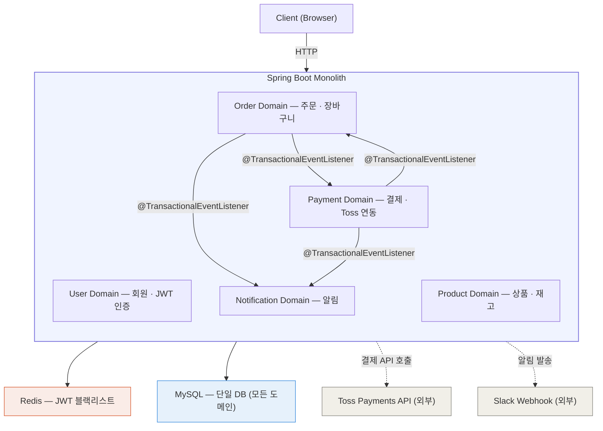
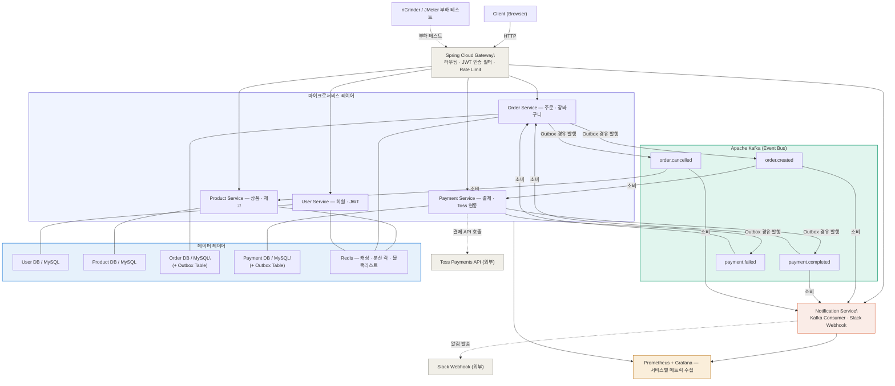

## 4. 아키텍처 방향

### 4-1. 코드 아키텍처: 4-Layered + DDD

각 도메인은 아래 4개 레이어로 구성됩니다.

| 레이어 | 패키지 | 역할 |
| --- | --- | --- |
| Presentation | `presentation/` | Controller, Request/Response DTO |
| Application | `application/` | UseCase, Command/Query 조율, 트랜잭션 경계 |
| Domain | `domain/` | Entity, VO, Domain Service, Repository 인터페이스 |
| Infrastructure | `infrastructure/` | Repository 구현체, Kafka, Redis, Toss 연동 |

> **핵심 원칙**: 비즈니스 로직은 Service가 아닌 Entity / Domain Service 안에 위치합니다.
**JPA 절충안**: 도메인 엔티티에 JPA 어노테이션(`@Entity`, `@Id`, `@Column` 등)을 허용하되, 비즈니스 로직은 JPA API(`EntityManager`, `Session` 등)에 의존하지 않습니다. Entity-Domain Entity 분리 + 매핑 레이어의 보일러플레이트를 피하면서도 도메인 순수성을 유지하는 실용적 절충안이며, 실무에서도 일반적인 접근 방식입니다.
>

### 4-2. 서비스 전략: 모놀리식 → MSA 분리

| 단계 | 구조 | 내용 |
| --- | --- | --- |
| Phase 1 | 모놀리식 | 단일 Spring Boot, 4-Layered + DDD, `@TransactionalEventListener` |
| Phase 2 | 성능 개선 | Redis 캐싱, Kafka + Outbox 패턴 도입, 재고 동시성 제어 |
| Phase 3 | 인프라 / 테스트 | K8s 배포, Prometheus + Grafana, 부하 테스트, HPA 검증 |
| Phase 4 | MSA 분리 | Gradle 멀티모듈, Spring Cloud Gateway, 서비스별 DB 분리 |

### 4-3. 인프라 전략: Kubernetes (minikube)

- Phase 1~2: Docker Compose로 로컬 개발 환경 구성
- Phase 3~4: minikube K8s 클러스터로 전환
- kube-prometheus-stack Helm 차트로 Prometheus + Grafana 구축
- HPA로 Order Service Pod 자동 수평 확장 검증
- Liveness / Readiness Probe 설정으로 비정상 Pod 자동 재시작

### 4-4. 레포 전략: 모노레포 (Gradle 멀티모듈)

- 단일 GitHub 레포에서 전체 서비스 구조를 한눈에 파악 가능
- `common` 모듈로 이벤트 DTO, 공통 예외, 응답 포맷 공유
- 실무 기준에서는 서비스별 독립 배포와 권한 분리를 위해 멀티레포가 적합하나, 포트폴리오 가시성과 개발 효율을 위해 모노레포 채택

### 4-5. MSA 분리 대상 서비스

- **Order Service** — 주문 폭주 시 독립 스케일아웃 필요
- **Payment Service** — 결제 플로우 격리, 장애 전파 방지
- **Notification Service** — Kafka Consumer 전용, 비동기 알림 처리

---

## 5. 시스템 아키텍처 다이어그램

### Phase 1 — 모놀리식



> Phase 1에서는 Prometheus+Grafana를 사용하지 않습니다 (Phase 3에서 도입).
Redis는 JWT 블랙리스트 용도로만 사용합니다. 캐싱과 분산 락은 Phase 2에서 도입합니다.
>

### Phase 4 — MSA



---

## 12. 패키지 구조

### Phase 1 — 모놀리식 (4-Layered + DDD)

```
peekcart/
├── build.gradle
├── settings.gradle
├── docker-compose.yml
│
└── src/main/java/com/peekcart/
    ├── PeekCartApplication.java
    │
    ├── user/
    │   ├── presentation/
    │   │   ├── UserController.java
    │   │   ├── request/
    │   │   └── response/
    │   ├── application/
    │   │   ├── UserCommandService.java
    │   │   ├── UserQueryService.java
    │   │   ├── AuthService.java
    │   │   └── dto/
    │   ├── domain/
    │   │   ├── User.java               # Entity + 비즈니스 로직
    │   │   ├── RefreshToken.java
    │   │   ├── Address.java
    │   │   ├── UserRole.java           # VO (Enum)
    │   │   └── UserRepository.java     # 인터페이스만 선언
    │   └── infrastructure/
    │       ├── UserRepositoryImpl.java
    │       ├── UserJpaRepository.java
    │       └── redis/
    │           └── TokenBlacklistRepository.java  # 블랙리스트 전용
    │
    ├── product/
    │   ├── presentation/
    │   ├── application/
    │   │   ├── ProductCommandService.java
    │   │   ├── ProductQueryService.java
    │   │   └── InventoryService.java
    │   ├── domain/
    │   │   ├── Product.java
    │   │   ├── Category.java
    │   │   ├── Inventory.java          # version 필드 (낙관적 락)
    │   │   └── ProductStatus.java      # VO (Enum)
    │   └── infrastructure/
    │
    ├── order/
    │   ├── presentation/
    │   ├── application/
    │   │   ├── OrderCommandService.java
    │   │   ├── OrderQueryService.java
    │   │   └── CartService.java
    │   ├── domain/
    │   │   ├── Order.java              # 주문 상태 전이 로직 포함
    │   │   ├── OrderItem.java
    │   │   ├── OrderStatus.java        # VO (Enum)
    │   │   └── OrderRepository.java
    │   └── infrastructure/
    │       └── event/
    │           └── OrderEventListener.java  # @TransactionalEventListener
    │
    ├── payment/
    │   ├── presentation/
    │   ├── application/
    │   │   ├── PaymentCommandService.java
    │   │   └── PaymentQueryService.java
    │   ├── domain/
    │   │   ├── Payment.java
    │   │   ├── PaymentStatus.java      # VO (Enum)
    │   │   └── PaymentRepository.java
    │   └── infrastructure/
    │       ├── toss/
    │       │   └── TossPaymentClient.java
    │       └── event/
    │           └── PaymentEventListener.java  # @TransactionalEventListener
    │
    ├── notification/
    │   ├── application/
    │   ├── domain/
    │   └── infrastructure/
    │       ├── event/
    │       │   └── NotificationEventListener.java  # @TransactionalEventListener
    │       └── slack/
    │           └── SlackNotificationClient.java  # Slack Webhook 발송
    │
    └── global/
        ├── config/
        │   ├── SecurityConfig.java
        │   └── RedisConfig.java
        ├── exception/
        │   ├── GlobalExceptionHandler.java
        │   ├── ErrorCode.java
        │   └── BusinessException.java
        ├── jwt/
        │   ├── JwtProvider.java
        │   └── JwtFilter.java
        └── response/
            └── ApiResponse.java
```

### Phase 2 — 패키지 변경점 (Delta)

Phase 2에서 Kafka + Outbox 패턴 도입에 따라 아래 패키지/클래스가 추가됩니다.

```
변경 사항:
│
├── order/
│   └── infrastructure/
│       ├── outbox/
│       │   ├── OutboxEvent.java
│       │   ├── OutboxEventRepository.java
│       │   └── OutboxEventPublisher.java    # Polling 스케줄러 (NEW)
│       ├── idempotency/
│       │   ├── ProcessedEvent.java
│       │   └── ProcessedEventRepository.java # 중복 소비 방지 (NEW)
│       ├── kafka/
│       │   └── OrderEventProducer.java       # Kafka 발행 (NEW)
│       └── event/
│           └── OrderEventListener.java       # Phase 1 유지 (Kafka 대체 대상)
│
├── payment/
│   └── infrastructure/
│       ├── outbox/
│       │   └── OutboxEventPublisher.java    # (NEW)
│       └── kafka/
│           ├── PaymentEventProducer.java    # (NEW)
│           └── PaymentEventConsumer.java    # order.created 소비 (NEW)
│
├── notification/
│   └── infrastructure/
│       └── kafka/
│           └── NotificationConsumer.java    # Kafka Consumer로 전환 (NEW)
│
├── product/
│   └── infrastructure/
│       └── redis/
│           └── ProductCacheRepository.java  # Redis 캐싱 (NEW)
│
└── global/
    └── config/
        └── KafkaConfig.java                 # (NEW)
```

### 레이어 책임 원칙

| 레이어 | 의존 방향 | 핵심 원칙 |
| --- | --- | --- |
| Presentation | → Application | DTO 변환만 담당, 비즈니스 로직 없음 |
| Application | → Domain | 트랜잭션 경계, UseCase 조율 |
| Domain | 없음 | JPA 어노테이션 허용, JPA API 미의존, 순수 비즈니스 로직 |
| Infrastructure | → Domain | Repository 인터페이스 구현, 외부 연동 |

### Phase 4 — MSA (Gradle 멀티모듈)

```
peekcart/
├── build.gradle
├── settings.gradle
├── docker-compose.yml
│
├── k8s/
│   ├── api-gateway/
│   │   ├── deployment.yaml
│   │   └── service.yaml
│   ├── order-service/
│   │   ├── deployment.yaml
│   │   ├── service.yaml
│   │   └── hpa.yaml
│   ├── payment-service/
│   ├── user-service/
│   ├── product-service/
│   ├── notification-service/
│   └── infra/
│       ├── kafka.yaml
│       ├── redis.yaml
│       └── mysql.yaml
│
├── common/
│   └── src/main/java/com/peekcart/common/
│       ├── event/
│       │   ├── OrderCreatedEvent.java
│       │   ├── PaymentCompletedEvent.java
│       │   ├── PaymentFailedEvent.java
│       │   └── OrderCancelledEvent.java
│       ├── outbox/
│       │   ├── OutboxEvent.java
│       │   └── OutboxEventPublisher.java  # 공통 Outbox 발행 로직
│       ├── idempotency/
│       │   ├── ProcessedEvent.java
│       │   └── IdempotentConsumer.java    # 중복 소비 방지 공통 로직
│       ├── exception/
│       └── response/
│
├── api-gateway/                           # Spring Cloud Gateway
│   └── src/main/java/com/peekcart/gateway/
│       ├── filter/
│       │   └── JwtAuthFilter.java
│       └── config/
│           └── RouteConfig.java
│
├── user-service/
├── product-service/
├── order-service/
│   └── src/main/java/com/peekcart/order/
│       ├── presentation/
│       ├── application/
│       ├── domain/
│       └── infrastructure/
│           ├── outbox/
│           └── kafka/
│               └── OrderEventProducer.java
│
├── payment-service/
│   └── src/main/java/com/peekcart/payment/
│       └── infrastructure/
│           ├── toss/
│           ├── outbox/
│           └── kafka/
│               ├── PaymentEventProducer.java
│               └── PaymentEventConsumer.java  # order.created 소비
│
└── notification-service/
    └── src/main/java/com/peekcart/notification/
        └── infrastructure/
            ├── kafka/
            │   └── NotificationConsumer.java
            └── slack/
                └── SlackNotificationClient.java
```

### Phase 1 → Phase 4 전환 시 주요 변경점

| 항목 | Phase 1 | Phase 4 |
| --- | --- | --- |
| 프로젝트 구조 | 단일 모듈 | Gradle 멀티모듈 |
| API Gateway | 없음 | Spring Cloud Gateway |
| 결제 실패 보상 | `@TransactionalEventListener` | Choreography Saga |
| 이벤트 DTO | 도메인 내부 `infrastructure/event/` | `common/event/` 공유 모듈 |
| Outbox | 도메인별 개별 구현 | `common/outbox/` 공유 모듈 |
| 인증 처리 | `global/jwt/` | `api-gateway` JWT 필터로 이동 |
| 인프라 | `docker-compose.yml` | `k8s/` 매니페스트 + Helm |
| DB 마이그레이션 | Flyway (단일 DB) | Flyway (서비스별 독립 마이그레이션) |
